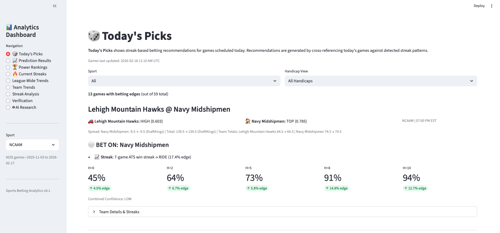
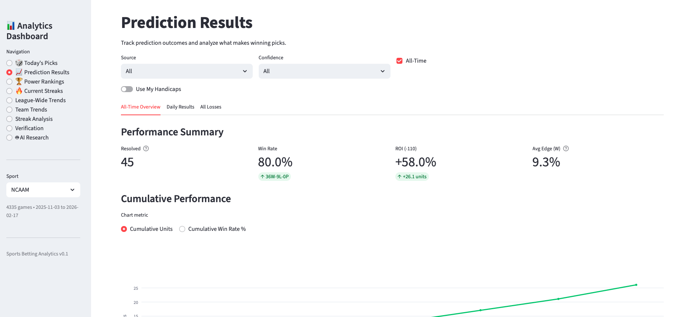

# Sports Betting Analytics

A data-driven sports betting platform that detects statistically significant betting patterns from historical game data and generates daily predictions. The system collects closing lines and scores nightly, computes network-based power ratings, identifies streak and matchup patterns with measurable edges over baseline, and surfaces actionable picks through an analytics dashboard.

Built on a fully automated AWS serverless pipeline — data collection, rating computation, pattern detection, and prediction generation all run daily on schedule with zero manual intervention.

**Sports covered:** NFL, NBA, NCAAM

## Dashboard

### Today's Picks
Cross-references today's scheduled games against detected patterns to surface bets with a statistical edge. Each pick shows the pattern that triggered it, the recommended bet, and coverage rates across handicap levels compared to league baseline.



### Prediction Results
Tracks every prediction to its outcome. Measures win rate, ROI at standard -110 odds, and cumulative performance over time — so strategy effectiveness is grounded in real results, not backtests alone.



### Streak Analysis
Explores the statistical foundation behind streak-based patterns. After a team hits a 5-game ATS win streak, how often do they cover at various handicap levels vs. the league baseline? This is the kind of analysis that feeds the pattern detection engine.


## How It Works

### 1. Data Collection
An automated pipeline collects closing spreads, totals, and final scores from [The Odds API](https://the-odds-api.com/) every morning via AWS Lambda + EventBridge.

### 2. Rating Engine
A network-based power rating system computes two ratings per team using iterative strength propagation:
- **Win Rating** — true team strength based on game outcomes
- **ATS Rating** — market-beating ability based on spread coverage

The gap between them reveals market inefficiency: when ATS rating significantly exceeds win rating, the market is undervaluing a team.

### 3. Pattern Detection
The analysis engine scans historical data for statistically significant edges across multiple dimensions:
- **Streak patterns** — how teams perform after N-game ATS win/loss streaks
- **Tier matchups** — how top-rated vs. bottom-rated teams perform at various handicap levels
- **Coverage profiles** — per-pattern coverage rates across handicap levels vs. league baseline

Patterns must clear minimum sample sizes and show a measurable edge over baseline to be surfaced.

### 4. Daily Predictions
Each morning, today's games are cross-referenced against all detected patterns. When a game matches a pattern with a proven edge, a prediction is generated with:
- The specific pattern and edge that triggered it
- Coverage rates at multiple handicap levels
- Combined confidence rating

### 5. Performance Tracking
Every prediction is tracked to its outcome. Win rate, ROI, and cumulative performance are computed to validate that detected patterns hold in real-time — not just in historical backtests.

## Architecture

```
┌──────────────────────────────────────────────────────────────────┐
│                        USER INTERFACES                           │
├──────────────────────────────────────────────────────────────────┤
│              Analytics Dashboard (Streamlit)                      │
│  - Today's Picks          - Power Rankings                       │
│  - Prediction Results     - Streak Analysis                      │
│  - Team & League Trends   - AI Research (natural language query)  │
└──────────────────────────────────┬───────────────────────────────┘
                                   │
                                   ▼
┌──────────────────────────┐          ┌──────────────────────────┐
│     AWS API Gateway      │          │   AWS RDS PostgreSQL     │
│  GET /predictions/{sport}│          │                          │
│  GET /results/{sport}    │          │   games                  │
└──────────────┬───────────┘          │   historical_ratings     │
               │                      │   todays_games           │
               ▼                      │   current_rankings       │
┌──────────────────────────┐          │   current_streaks        │
│    AWS Lambda Functions  │          │   detected_patterns      │
│                          │          └──────────────────────────┘
│  collect_yesterday_games │──→ The Odds API
│  collect_todays_games    │
│  generate_hist_ratings   │
│  daily_precompute        │
│  evaluate_strategy       │
│  predictions_api         │
│  results_api             │
└──────────────┬───────────┘
               │
               ▼
┌──────────────────────────┐
│         AWS S3           │
│  predictions/*.json      │
│  strategy_tracking/*.json│
└──────────────────────────┘
```

### Automated Daily Schedule (EST)

| Time | Lambda Function | Purpose |
|------|----------------|---------|
| 3:00 AM | `evaluate_strategy_results` | Match yesterday's predictions to outcomes |
| 6:00 AM | `collect_yesterday_games` | Collect final scores + closing spreads |
| 6:10 AM | `collect_todays_games` | Fetch today's games + lines from Odds API |
| 6:15 AM | `generate_historical_ratings` | Compute daily team rating snapshots |
| 6:30 AM | `daily_precompute` | Rankings, streaks, patterns, recommendations |

## Tech Stack

**Backend:** Python 3.12, SQLAlchemy Core, pandas, boto3

**Infrastructure:** AWS Lambda, RDS (PostgreSQL), S3, API Gateway, EventBridge, Secrets Manager

**Dashboard:** Streamlit, Plotly

**Data Source:** [The Odds API](https://the-odds-api.com/)

## Project Structure

```
sports-betting/
├── backend/
│   ├── src/
│   │   ├── analysis/            # Prediction engine
│   │   │   ├── network_ratings.py   # Iterative power ratings
│   │   │   ├── insights.py          # Streak pattern detection
│   │   │   ├── tier_matchups.py     # Matchup pattern detection
│   │   │   ├── backtest_ratings.py  # Strategy backtesting
│   │   │   └── todays_recommendations.py
│   │   ├── db/                  # SQLAlchemy layer
│   │   ├── ai/                  # Natural language query (Bedrock)
│   │   ├── odds_api_client.py   # The Odds API client
│   │   └── config.py
│   ├── dashboard/               # Streamlit analytics app
│   ├── lambda_functions/        # AWS Lambda handlers
│   └── scripts/                 # Deployment & operations
```
